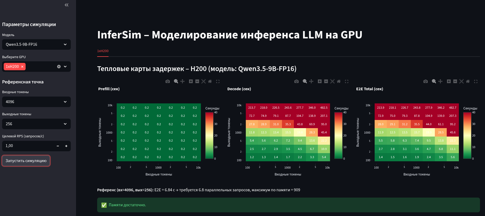

# InferSim+ Dashboard

Веб-интерфейс для симуляции инференса больших языковых моделей (LLM) на различных GPU-конфигурациях. Проект основан на открытом симуляторе [InferSim от Alibaba](https://github.com/alibaba/InferSim), доработан для российского рынка и поддерживает модели семейств Qwen, DeepSeek, а также оборудование MetaX.

С помощью этого инструмента можно **заранее оценить** задержки (TTFT, TPOT), пропускную способность и требуемый объём GPU-памяти **без запуска реального инференса**. Это помогает избежать дорогих ошибок при закупке железа и правильно спланировать инфраструктуру под нагрузки.



## 🚀 Возможности

- **Симуляция LLM-инференса без GPU** – расчёт метрик на основе аналитических моделей и бенчмарков.
- **Тепловые карты задержек** – наглядное отображение Prefill, Decode и E2E Total для разных комбинаций входных/выходных токенов.
- **Анализ пропускной способности (RPS)** – проверка, выдержит ли конфигурация заданный поток запросов.
- **Гибкое управление конфигурациями** – YAML‑файлы для моделей (`model_config.yaml`) и GPU (`gpu_config.yaml`), легко расширяются.
- **Поддержка гибридных архитектур** – корректное моделирование Qwen3.5‑9B с Gated DeltaNet.
- **Кастомное железо** – например, профили для MetaX C500 и других карт.
- **Авторизация** – Basic Auth через Nginx (опционально).
- **Автоматический деплой** – GitHub Actions собирает Docker‑образ, доставляет на VDS и перезапускает контейнеры.

## 📁 Структура проекта

```
├── back/                     # Ядро InferSim (симулятор)
│   ├── main.py               # Точка входа симулятора
│   ├── models/               # Модели архитектур (Hybrid, MHA, GQA)
│   ├── config/               # Загрузка конфигураций моделей
│   ├── hardware/             # Характеристики GPU (gpu.py)
│   ├── bench_data/           # Бенчмарки MFU и GDN
│   └── hf_configs/           # JSON‑конфиги моделей
├── common/                   # Общие утилиты
│   ├── utils.py              # Парсер вывода, загрузка конфигов, расчёт параллельности
│   ├── gpu_config.yaml       # Список доступных GPU
│   └── model_config.yaml     # Список доступных моделей
├── front/                    # Веб-интерфейс Streamlit
│   └── main.py               # Приложение с кэшированием и визуализацией
├── .github/workflows/        # CI/CD
│   └── deploy.yml            # Автоматический деплой на VDS
├── Dockerfile                # Сборка контейнера
├── docker-compose.yml        # Оркестрация сервисов (+ Nginx)
├── nginx.conf                # Конфигурация reverse-прокси с SSL и Basic Auth
├── requirements.txt          # Зависимости (Streamlit, Plotly, PyYAML)
└── README.md
```

## ⚡ Быстрый старт (локально)

```bash
git clone <ваш-репозиторий>
cd InferSim

# Создайте виртуальное окружение и установите зависимости
python3 -m venv venv
source venv/bin/activate
pip install -r requirements.txt

# Добавьте PYTHONPATH, чтобы симулятор нашёл модули
export PYTHONPATH=$(pwd)/back:$(pwd)

# Запустите веб-интерфейс
streamlit run front/main.py
```

Приложение откроется по адресу http://localhost:8501.

## 🖥️ Добавление своего GPU

1. Отредактируйте `common/gpu_config.yaml`, добавив новую запись:

```yaml
- name: "MyGPU"
  device_type: "MyGPU"
  display_name: "My Super GPU (64 GB)"
  world_size: 1
  memory_gb: 64
```

2. В файле `back/hardware/gpu.py` создайте экземпляр GPU с характеристиками (TFLOPS, пропускная способность памяти) и добавьте его в словарь gpu_map.

3. При необходимости положите бенчмарки в `back/bench_data/mha/.../MyGPU/` или используйте аналитические приближения (MFU).

## 🤖 Добавление новой модели

1. Поместите JSON‑конфиг модели в `back/hf_configs/`.

2. В `common/model_config.yaml` добавьте запись:

```yaml
- name: "MyModel-7B"
  config_path: "hf_configs/my_model_config.json"
  num_layers: 32
  num_kv_heads: 8
  head_dim: 128
  dtype_bytes: 2
  weight_gb: 14.0
  overhead_gb: 2.8
```

3. Для гибридных моделей (как Qwen3.5‑9B) укажите `num_full_attn_layers`, `num_linear_attn_layers` и параметры линейного внимания. JSON‑конфиг должен содержать ключ `text_config` с вложенными полями.

## 🚢 Деплой на VDS

* SSH_HOST – IP сервера.
* SSH_USER – имя пользователя.
* SSH_PRIVATE_KEY – приватный SSH‑ключ (скопируйте содержимое файла).

## 🙏 Благодарности

* Команде Alibaba InferSim за открытый инструмент.
* Сообществу vLLM и FlashInfer за бенчмарки и оптимизации.
* Разработчикам Streamlit и Plotly за удобный интерфейс.